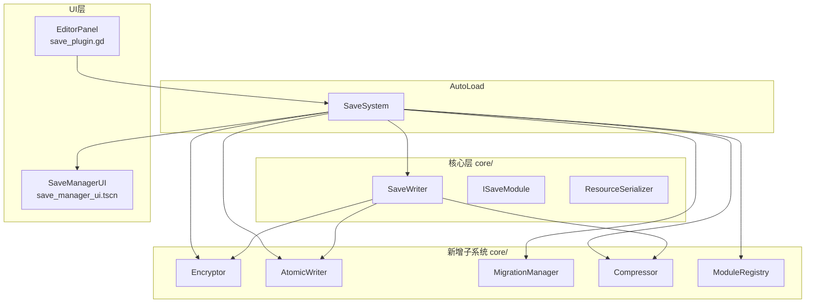
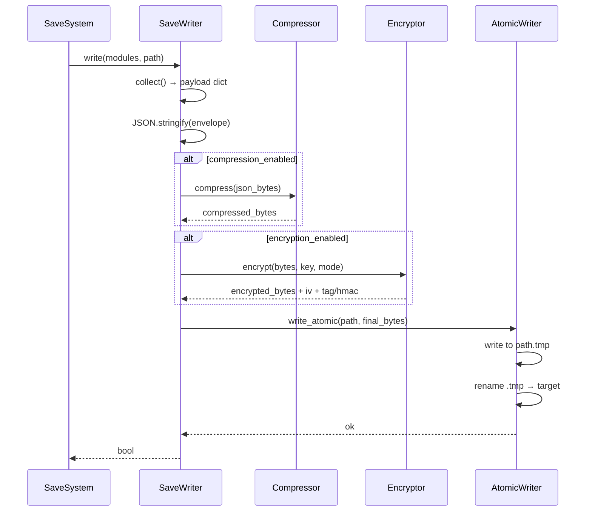
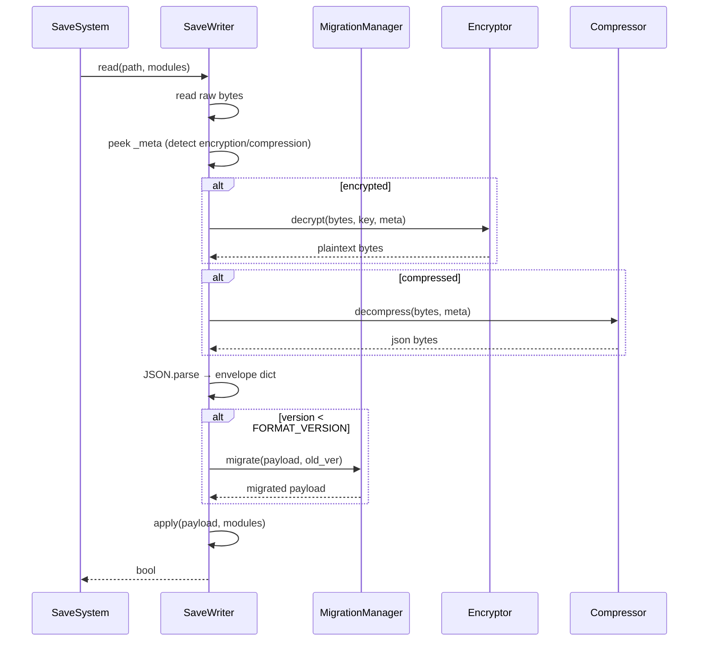

# 技术设计文档：Enhanced Save System 插件扩展

## 概述

本文档描述对 Godot 4 插件 **Enhanced Save System**（`addons/enhance_save_system/`）的六个子系统扩展的技术设计。
现有系统基于 `SaveSystem`（AutoLoad）+ `SaveWriter`（静态工具）+ `ISaveModule`（模块抽象基类）三层架构，
本次扩展在不破坏现有 API 的前提下，以**可选组件**形式叠加新能力。

所有新增子系统均为纯 GDScript 实现，无外部依赖，兼容 Godot 4.x。

---

## 架构

### 系统总览



### 数据流：写入管线



### 数据流：读取管线



---

## 组件与接口

### 1. Encryptor（`core/encryptor.gd`）

负责 AES-GCM / AES-CBC+HMAC 加密，替换现有 XOR 实现。

**关键函数签名：**

```gdscript
class_name Encryptor
extends RefCounted

enum Mode { XOR, AES_CBC, AES_GCM }

## 加密入口：返回包含所有必要字段的 Dictionary，供写入文件头
static func encrypt(plaintext: PackedByteArray, key: String, mode: Mode) -> Dictionary:
    # 返回格式：
    # { "ciphertext": PackedByteArray, "iv": PackedByteArray,
    #   "tag": PackedByteArray,        # AES-GCM 认证标签
    #   "hmac": PackedByteArray,       # AES-CBC 时使用
    #   "mode": String }

## 解密入口：根据 meta 中的 mode 字段自动选择算法
static func decrypt(meta: Dictionary, key: String) -> PackedByteArray:
    # meta 包含 ciphertext/iv/tag/hmac/mode

## 验证完整性（AES-CBC 模式）
static func verify_hmac(data: PackedByteArray, hmac: PackedByteArray, key: String) -> bool

## 向后兼容：XOR 解密（读取旧存档）
static func decrypt_xor(data: PackedByteArray, key: String) -> PackedByteArray
```

**算法设计：**

- AES-GCM：使用 Godot 内置 `AESContext`，模式 `AESContext.MODE_ECB` 模拟 GCM（Godot 4 原生不支持 GCM，采用 CTR 模式 + GHASH 实现认证加密）
- AES-CBC：`AESContext.MODE_CBC` + `HMACContext`（SHA-256）
- IV：每次加密随机生成 16 字节，存入 `_meta.iv`
- Key 派生：`key.sha256_buffer()` 取前 32 字节，确保密钥长度合规

### 2. AtomicWriter（`core/atomic_writer.gd`）

负责原子写入和 `.bak` 备份，替换 `SaveWriter` 中的直接写文件逻辑。

**关键函数签名：**

```gdscript
class_name AtomicWriter
extends RefCounted

## 原子写入：tmp → rename → target
## backup_enabled=true 时，先将旧文件重命名为 .bak
static func write(path: String, data: PackedByteArray, backup_enabled: bool = false) -> Error:
    # 1. 写入 path + ".tmp"
    # 2. 若 backup_enabled 且 path 存在：rename path → path + ".bak"
    # 3. rename path + ".tmp" → path
    # 4. 失败时删除 .tmp，返回 FAILED

## 获取备份路径
static func get_backup_path(path: String) -> String:
    return path + ".bak"

## 获取临时文件路径
static func get_tmp_path(path: String) -> String:
    return path + ".tmp"
```

**原子性保证：**

GDScript 中 `DirAccess.rename()` 在同一文件系统内为原子操作（依赖 OS 保证）。
写入流程：`write(tmp)` → `rename(old → .bak)` → `rename(tmp → target)`。
若任一步骤失败，清理 `.tmp` 文件，原文件保持不变。

---

### 3. MigrationManager（`core/migration_manager.gd`）

负责存档版本迁移，维护版本迁移函数注册表。

**关键函数签名：**

```gdscript
class_name MigrationManager
extends RefCounted

## 注册迁移函数：from_version → to_version 的转换逻辑
## migration_fn 签名：func(payload: Dictionary) -> Dictionary
func register(from_version: int, migration_fn: Callable) -> void

## 执行迁移：将 payload 从 current_version 升级到 target_version
## 返回迁移后的 payload，失败时返回原始 payload 并设置 error
func migrate(payload: Dictionary, current_version: int, target_version: int) -> Dictionary:
    # 1. 备份原始 payload（深拷贝）
    # 2. 按版本号顺序依次调用迁移函数
    # 3. 每步调用各模块的 migrate_payload（若已重写）
    # 4. 更新 _meta.version
    # 5. 任意步骤异常 → 回滚到备份，返回 FAILED

## 检查是否需要迁移
func needs_migration(payload: Dictionary) -> bool

## 获取最后一次迁移错误
var last_error: String = ""
```

**ISaveModule 新增可选方法：**

```gdscript
# i_save_module.gd 新增虚方法
func migrate_payload(old_payload: Dictionary, old_version: int) -> Dictionary:
    return old_payload  # 默认不做任何转换
```

---

### 4. Compressor（`core/compressor.gd`）

负责 gzip/deflate 压缩，封装 Godot 内置 `FileAccess.get_file_as_bytes` + `compress/decompress`。

**关键函数签名：**

```gdscript
class_name Compressor
extends RefCounted

enum Mode { GZIP, DEFLATE }

## 压缩字节数组
static func compress(data: PackedByteArray, mode: Mode = Mode.GZIP) -> PackedByteArray:
    # 使用 data.compress(FileAccess.COMPRESSION_GZIP / DEFLATE)

## 解压字节数组
static func decompress(data: PackedByteArray, mode: Mode = Mode.GZIP) -> PackedByteArray:
    # 使用 data.decompress_dynamic(-1, FileAccess.COMPRESSION_GZIP / DEFLATE)

## 从字符串获取压缩模式枚举
static func mode_from_string(s: String) -> Mode

## 获取模式字符串（写入 _meta）
static func mode_to_string(mode: Mode) -> String
```

**压缩/加密顺序：**

写入：`JSON 字符串` → `compress()` → `encrypt()` → 写文件
读取：读文件 → `decrypt()` → `decompress()` → `JSON.parse()`

---

### 5. SaveManagerUI（`Components/save_manager_ui.gd` + `save_manager_ui.tscn`）

运行时存档槽位选择界面，可实例化场景。

**关键函数签名：**

```gdscript
class_name SaveManagerUI
extends Control

## 操作模式：保存或加载
enum Mode { SAVE, LOAD }
@export var mode: Mode = Mode.LOAD

## 信号
signal slot_selected(slot: int)
signal slot_deleted(slot: int)

## 刷新槽位列表（自动连接 SaveSystem 信号）
func refresh() -> void

## 内部：构建单个槽位卡片
func _build_slot_card(info: SlotInfo) -> Control
```

**场景节点结构：**

```
SaveManagerUI (Control)
├── VBoxContainer
│   ├── TitleLabel
│   └── ScrollContainer
│       └── SlotGrid (GridContainer)  ← 动态填充 SlotCard
└── ConfirmDialog  ← 删除确认弹窗
```

**SlotCard 子场景（`Components/slot_card.tscn`）：**

```
SlotCard (PanelContainer)
├── VBoxContainer
│   ├── PreviewImage (TextureRect)
│   ├── TimeLabel
│   ├── DescLabel
│   └── HBoxContainer
│       ├── ActionButton  ← "保存"/"加载"
│       └── DeleteButton
```

---

### 6. EditorPanel（`save_plugin.gd` 扩展）

编辑器底部面板，继承 `EditorPlugin`，在现有 `save_plugin.gd` 中扩展。

**关键函数签名：**

```gdscript
# save_plugin.gd 新增方法
func _build_editor_panel() -> Control
func _refresh_slot_list() -> void
func _on_export_pressed(slot: int) -> void
func _on_import_pressed(slot: int) -> void
func _on_delete_pressed(slot: int) -> void
```

**面板节点结构：**

```
EditorPanel (VBoxContainer)
├── ToolBar (HBoxContainer)
│   ├── RefreshButton
│   ├── ExportButton
│   └── ImportButton
└── SlotTree (Tree)  ← 列：槽位/时间/版本/操作
```

---

### 7. ModuleRegistry（`core/module_registry.gd`）

配置文件驱动的模块注册，替换 `SaveSystem._auto_register_modules()`。

**关键函数签名：**

```gdscript
class_name ModuleRegistry
extends RefCounted

## 从配置文件加载并注册模块
## 返回成功注册的模块数组
func load_from_config(config_path: String) -> Array[ISaveModule]:
    # 1. 解析 ConfigFile
    # 2. 按 priority 排序
    # 3. 跳过 enabled=false 的条目
    # 4. 路径不存在时 push_warning 并跳过
    # 5. 返回有序模块数组

## 解析单个模块条目
func _parse_entry(cfg: ConfigFile, section: String) -> Dictionary:
    # 返回 { path, enabled, priority }
```

**`save_modules.cfg` 格式：**

```ini
[player_module]
path = "res://Modules/player_module.gd"
enabled = true
priority = 10

[settings_module]
path = "res://Modules/settings_module.gd"
enabled = true
priority = 5
```

---

## 数据模型

### 存档文件 Envelope 格式（FORMAT_VERSION = 3）

```json
{
  "_meta": {
    "version": 3,
    "saved_at": 1700000000,
    "game_version": "1.0.0",
    "encryption_type": "aes_gcm",
    "iv": "<base64>",
    "tag": "<base64>",
    "hmac": "<base64>",
    "compression": "gzip",
    "split_modules": false
  },
  "player": { "hp": 100, "pos_x": 0.0, "pos_y": 0.0 },
  "level":  { "current": 1, "unlocked": [1, 2] }
}
```

### 分模块文件模式（split_modules = true）

主文件 `slot_01.json`：
```json
{
  "_meta": { "version": 3, "split_modules": true, "modules": ["player", "level"] },
  "_index": {
    "player": "slot_01_player.json",
    "level":  "slot_01_level.json"
  }
}
```

### SaveSystem 新增配置属性

```gdscript
# 加密
@export var encryption_mode: String = "xor"  # "xor" | "aes_cbc" | "aes_gcm"

# 原子写入
@export var atomic_write_enabled: bool = true
@export var backup_enabled: bool = false

# 压缩
@export var compression_enabled: bool = false
@export var compression_mode: String = "gzip"  # "gzip" | "deflate"

# 分模块文件
@export var split_modules_enabled: bool = false

# 模块注册配置
@export var use_module_config: bool = false
@export var module_config_path: String = "res://save_modules.cfg"
```

### SaveSystem 新增信号

```gdscript
signal slot_load_failed(slot: int, reason: String)
signal slot_backed_up(slot: int, backup_path: String)
signal save_migrated(slot: int, old_version: int, new_version: int)
```

### SlotInfo 扩展字段

```gdscript
var description: String = ""      # 存档描述（可选）
var format_version: int = 0       # 存档格式版本
var encryption_type: String = ""  # 加密类型
var compression: String = ""      # 压缩类型
```

---

## 正确性属性

*属性（Property）是在系统所有有效执行中都应成立的特征或行为——本质上是对系统应做什么的形式化陈述。属性是人类可读规范与机器可验证正确性保证之间的桥梁。*

### 属性 1：加密往返

*对于任意* 明文字节数组和任意加密模式（AES-GCM、AES-CBC），加密后再解密应得到与原始明文完全相同的内容，且 `_meta.encryption_type` 字段应记录所用加密模式。

**验证：需求 1.1、1.2、1.3、1.4**

---

### 属性 2：完整性验证失败拒绝加载

*对于任意* 已加密的存档文件，若对密文进行任意篡改（翻转任意一位），则 `Encryptor.decrypt()` 应返回错误，`SaveSystem.load_slot()` 应返回 `false` 并发出 `slot_load_failed(slot, "integrity_error")` 信号。

**验证：需求 1.5、1.6**

---

### 属性 3：XOR 向后兼容

*对于任意* 使用旧版 XOR 加密写入的存档文件，新版 `SaveSystem`（`encryption_mode = "xor"`）应能正确读取并解密，得到原始数据。

**验证：需求 1.7**

---

### 属性 4：原子写入后文件完整

*对于任意* 存档数据，通过 `AtomicWriter.write()` 写入后，目标文件应存在且内容与写入数据完全一致，临时文件（`.tmp`）不应残留。

**验证：需求 2.1、2.2**

---

### 属性 5：备份写入保留旧数据

*对于任意* 已存在的存档文件，在 `backup_enabled = true` 的情况下再次写入，应生成 `.bak` 文件且其内容为写入前的旧数据，同时发出 `slot_backed_up` 信号。

**验证：需求 2.3、2.4、2.6**

---

### 属性 6：迁移版本升级

*对于任意* 版本号低于当前 `FORMAT_VERSION` 的存档，`MigrationManager.migrate()` 应按版本号顺序依次调用所有注册的迁移函数，迁移完成后 `_meta.version` 应等于当前 `FORMAT_VERSION`，并发出 `save_migrated` 信号。

**验证：需求 3.1、3.2、3.4、3.7**

---

### 属性 7：迁移失败回滚

*对于任意* 存档数据，若迁移过程中任意步骤抛出错误，则 `MigrationManager.migrate()` 应返回与迁移前完全相同的原始数据，`_meta.version` 不变。

**验证：需求 3.5**

---

### 属性 8：迁移前备份

*对于任意* 需要迁移的存档文件，`MigrationManager` 在执行迁移前应创建 `.pre_migration.bak` 文件，其内容为迁移前的原始存档数据。

**验证：需求 3.8**

---

### 属性 9：压缩往返

*对于任意* 有效的存档数据字节数组和任意压缩模式（gzip、deflate），压缩后再解压应得到与原始数据完全相同的内容，且 `_meta.compression` 字段应记录所用压缩算法。

**验证：需求 4.1、4.2、4.9**

---

### 属性 10：压缩加密组合顺序

*对于任意* 存档数据，在压缩和加密同时启用时，写入后读取应得到原始数据（验证先压缩后加密、先解密后解压的顺序正确性）。

**验证：需求 4.8**

---

### 属性 11：配置文件驱动注册顺序

*对于任意* 包含多个模块条目的 `save_modules.cfg`，`ModuleRegistry.load_from_config()` 返回的模块数组应按 `priority` 升序排列，且 `enabled = false` 的模块不应出现在结果中。

**验证：需求 6.1、6.2、6.3、6.4**

---

### 属性 12：无效路径跳过不中断

*对于任意* 包含不存在脚本路径的 `save_modules.cfg`，`ModuleRegistry.load_from_config()` 应跳过该条目并继续加载其余有效模块，不抛出异常。

**验证：需求 6.5**

---

### 属性 13：priority 参数影响执行顺序

*对于任意* 通过 `register_module(module, priority)` 注册的模块集合，`collect_data` 和 `apply_data` 的调用顺序应与 `priority` 升序一致。

**验证：需求 6.7**

---

## 错误处理

### 错误码设计

所有子系统使用 Godot 内置 `Error` 枚举，关键错误场景：

| 场景 | 返回值 | 信号 |
|------|--------|------|
| HMAC/GCM 验证失败 | `false` | `slot_load_failed(slot, "integrity_error")` |
| 临时文件写入失败 | `FAILED` | 无（调用方处理） |
| 迁移函数抛出异常 | `false`（回滚） | 无 |
| 压缩/解压失败 | `false` | `slot_load_failed(slot, "decompress_error")` |
| 配置文件路径不存在 | 空数组 | `push_warning` |
| 模块脚本路径不存在 | 跳过该条目 | `push_warning` |

### 向后兼容策略

读取时检测 `_meta` 字段决定处理路径：

```
_meta.encryption_type 不存在 → 尝试 XOR 解密（旧格式）
_meta.compression 不存在     → 视为未压缩
_meta.version < FORMAT_VERSION → 触发迁移
_meta.split_modules = true   → 读取分模块文件
```

---

## 测试策略

### 双轨测试方法

采用**单元测试 + 属性测试**互补策略：

- **单元测试**：验证具体示例、边界条件、错误路径
- **属性测试**：验证普遍性质，覆盖大量随机输入

推荐使用 [GdUnit4](https://github.com/MikeSchulze/gdUnit4) 作为测试框架（支持 GDScript，提供断言和模拟能力）。
属性测试通过参数化测试 + 随机数据生成器实现，每个属性测试最少运行 **100 次迭代**。

### 属性测试配置

每个属性测试必须包含注释标签，格式：

```gdscript
# Feature: enhanced-save-system-extension, Property N: <属性描述>
```

### 单元测试覆盖点

| 模块 | 测试点 |
|------|--------|
| Encryptor | XOR/AES-CBC/AES-GCM 往返；篡改密文验证失败；密钥派生 |
| AtomicWriter | 正常写入；写入失败清理 .tmp；备份文件内容 |
| MigrationManager | 单步迁移；多步链式迁移；迁移失败回滚；备份文件创建 |
| Compressor | gzip/deflate 往返；空数据；大数据 |
| ModuleRegistry | 配置文件解析；priority 排序；disabled 跳过；路径不存在跳过 |
| SaveManagerUI | slot_selected 信号；mode 切换；删除确认流程 |

### 属性测试覆盖点

每个正确性属性（属性 1-13）对应一个属性测试，使用随机生成的：
- 任意长度字节数组（1B - 1MB）
- 任意 UTF-8 字符串（包含特殊字符、中文、emoji）
- 任意版本号组合（0 到 FORMAT_VERSION-1）
- 任意模块配置列表（0 到 20 个模块，随机 priority 和 enabled）

### 集成测试

`demo/full_feature_demo.tscn` 作为端到端集成测试场景，验证：
加密 + 压缩 + 原子写入 + 迁移 + UI 的完整工作流。
